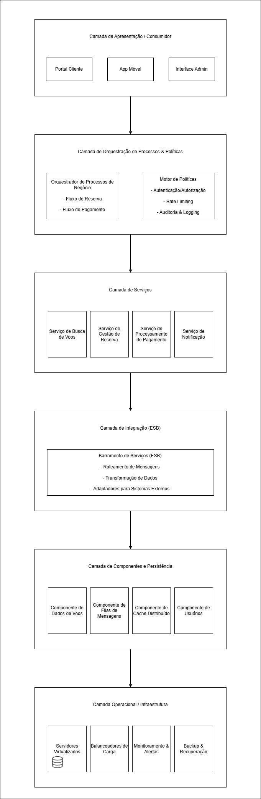

# Arquitetura SOA e Requisitos Não Funcionais

# Sistema de Reservas de Voos com Arquitetura SOA

## Introdução

Este repositório contém a arquitetura de um sistema de reservas de voos altamente integrado, desenvolvido com base em uma Arquitetura Orientada a Serviços (SOA). A solução incorpora os três elementos principais da arquitetura SOA:

- **Serviços**: Componentes independentes que encapsulam funcionalidades específicas do negócio
- **ESB (Enterprise Service Bus)**: Camada de integração que facilita a comunicação entre serviços
- **Políticas e Processos**: Regras e fluxos que governam o comportamento do sistema

O diagrama de arquitetura foi desenvolvido utilizando a ferramenta **draw.io**, permitindo uma representação visual clara e modificável dos componentes e suas interações.

A arquitetura foi projetada incorporando os princípios da norma **ISO 25010**, que define um modelo de qualidade para sistemas e software. Esta norma estabelece características e subcaracterísticas que devem ser consideradas ao avaliar a qualidade de um produto de software, garantindo que o sistema atenda aos requisitos funcionais e não funcionais necessários para uma experiência de usuário satisfatória e um desempenho operacional eficiente.

## Diagrama de Arquitetura SOA

Figura 1 - Arquitetura Arquitetura Orientada a Serviços (SOA) 

Fonte: Material produzido pelos autores (2025) 

O diagrama acima representa a arquitetura SOA do sistema de reservas de voos, organizada nas seguintes camadas:

### Camada de Apresentação / Consumidor
Esta camada fornece interfaces para diferentes tipos de usuários interagirem com o sistema:
- **Portal Cliente**: Interface web para usuários realizarem buscas e reservas de voos
- **App Móvel**: Aplicativo para dispositivos móveis com funcionalidades semelhantes ao portal
- **Interface Admin**: Painel administrativo para funcionários da companhia aérea gerenciarem voos e clientes

**Justificativa**: A separação das interfaces permite atender diferentes perfis de usuários (clientes e administradores) e dispositivos (desktop e móvel), mantendo a lógica de negócio centralizada nas camadas inferiores. Esta camada apenas consome os serviços expostos, sem implementar regras de negócio.

### Camada de Orquestração de Processos & Políticas
Esta camada coordena a execução dos processos de negócio e aplica políticas:
- **Orquestrador de Processos**: Gerencia fluxos completos como reserva e pagamento, coordenando chamadas entre serviços
- **Motor de Políticas**: Implementa regras de segurança, controle de acesso e auditoria

**Justificativa**: A orquestração centralizada permite definir fluxos de negócio complexos sem codificá-los diretamente nos serviços, facilitando alterações nos processos. O motor de políticas garante que aspectos transversais como segurança sejam aplicados de forma consistente em toda a arquitetura.

### Camada de Serviços
Esta camada contém os serviços de negócio que implementam as funcionalidades principais:
- **Serviço de Busca de Voos**: Processa critérios de busca e retorna opções de voos disponíveis
- **Serviço de Gestão de Reservas**: Gerencia o ciclo de vida das reservas, desde a seleção até a confirmação
- **Serviço de Processamento de Pagamento**: Processa transações financeiras para as reservas
- **Serviço de Notificação**: Envia confirmações e alertas por e-mail e outros canais

**Justificativa**: Os serviços são desacoplados e focados em domínios específicos, permitindo desenvolvimento, teste e escalabilidade independentes. Cada serviço encapsula sua lógica de negócio e expõe interfaces bem definidas, facilitando a reutilização e manutenção.

### Camada de Integração (ESB)
Esta camada facilita a comunicação entre serviços internos e externos:
- **Barramento de Serviços (ESB)**: Fornece roteamento de mensagens, transformação de dados e adaptadores para sistemas externos

**Justificativa**: O ESB reduz o acoplamento entre serviços, abstraindo detalhes de comunicação e protocolos. Ele simplifica a integração com sistemas externos (como GDS de voos, gateways de pagamento e serviços de geolocalização) através de adaptadores padronizados, permitindo substituir provedores externos sem impactar os serviços internos.

### Camada de Componentes e Persistência
Esta camada gerencia o armazenamento e acesso aos dados:
- **Componente de Dados de Voos**: Gerencia informações sobre voos, rotas e disponibilidade
- **Componente de Filas de Mensagens**: Suporta comunicação assíncrona entre serviços
- **Componente de Cache Distribuído**: Armazena dados frequentemente acessados para melhorar performance
- **Componente de Usuários**: Gerencia dados de clientes e funcionários

**Justificativa**: A separação da persistência em componentes especializados permite escolher o modelo de armazenamento mais adequado para cada tipo de dado. O uso de filas e cache melhora a resiliência e performance do sistema, especialmente em momentos de pico de utilização.

### Camada Operacional / Infraestrutura
Esta camada fornece os recursos computacionais e operacionais:
- **Servidores Virtualizados**: Infraestrutura computacional para execução dos serviços
- **Balanceadores de Carga**: Distribuição de tráfego para garantir disponibilidade e performance
- **Monitoramento & Alertas**: Supervisão contínua do sistema para identificar problemas
- **Backup & Recuperação**: Proteção contra perda de dados e falhas

**Justificativa**: Uma infraestrutura robusta e flexível é essencial para garantir a disponibilidade e escalabilidade do sistema. O monitoramento contínuo permite identificar e resolver problemas rapidamente, enquanto os mecanismos de backup garantem a continuidade do negócio em caso de falhas.

## Requisitos Não Funcionais (ISO 25010)

A tabela abaixo apresenta os requisitos não funcionais do sistema, alinhados com as características de qualidade definidas na norma ISO 25010:

| Característica ISO 25010 | Requisito Não Funcional | Justificativa | Relação com SOA |
|--------------------------|-------------------------|---------------|-----------------|
| **Eficiência de Desempenho** | O sistema deve responder a consultas de voos em menos de 300ms | Usuários esperam respostas rápidas ao pesquisar voos; tempos de resposta lentos podem levar à desistência e perda de vendas | A arquitetura SOA permite otimizar o desempenho através de cache distribuído e processamento paralelo. O ESB pode rotear solicitações para instâncias menos carregadas, e serviços podem ser otimizados individualmente para suas funções específicas |
| **Confiabilidade** | O sistema deve manter disponibilidade de 99,9% (uptime) | Um sistema de reservas de voos precisa estar disponível 24/7; interrupções resultam diretamente em perda de receita e danos à reputação da companhia aérea | O desacoplamento entre serviços na arquitetura SOA permite implementar redundância e failover em componentes críticos. Se um serviço falhar, outros podem continuar funcionando, minimizando o impacto para os usuários |
| **Compatibilidade** | O sistema deve integrar-se com múltiplos serviços externos (GDS, gateways de pagamento, serviços de geolocalização) | O sistema precisa interoperar com diversos sistemas externos usando diferentes protocolos e formatos de dados | O ESB na camada de integração facilita a interoperabilidade através de adaptadores que abstraem as diferenças entre sistemas externos, permitindo que os serviços internos se comuniquem usando formatos padronizados |
| **Segurança** | O sistema deve proteger dados sensíveis dos clientes conforme regulamentações (LGPD, PCI-DSS) | O sistema lida com dados sensíveis como informações pessoais e financeiras dos clientes, exigindo proteção adequada contra acesso não autorizado e vazamentos | O Motor de Políticas na camada de orquestração centraliza a implementação de controles de segurança como autenticação, autorização e criptografia, garantindo aplicação consistente em todos os serviços |
| **Manutenibilidade** | O sistema deve permitir a adição de novos serviços em menos de 5 dias úteis | Em um sistema distribuído complexo, é essencial ter capacidade de evolução e adaptação rápida às mudanças de requisitos de negócio | A arquitetura SOA facilita a manutenção através de serviços desacoplados com interfaces bem definidas, permitindo que componentes sejam modificados ou substituídos com impacto mínimo no restante do sistema |

Estes requisitos não funcionais foram cuidadosamente selecionados para garantir que o sistema de reservas de voos atenda às expectativas dos usuários e às necessidades do negócio, seguindo as melhores práticas de arquitetura SOA e os padrões de qualidade da ISO 25010.
